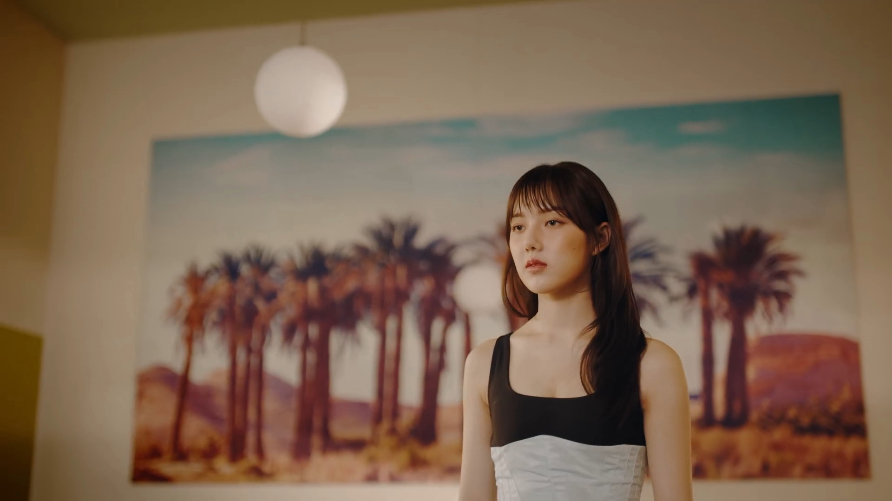
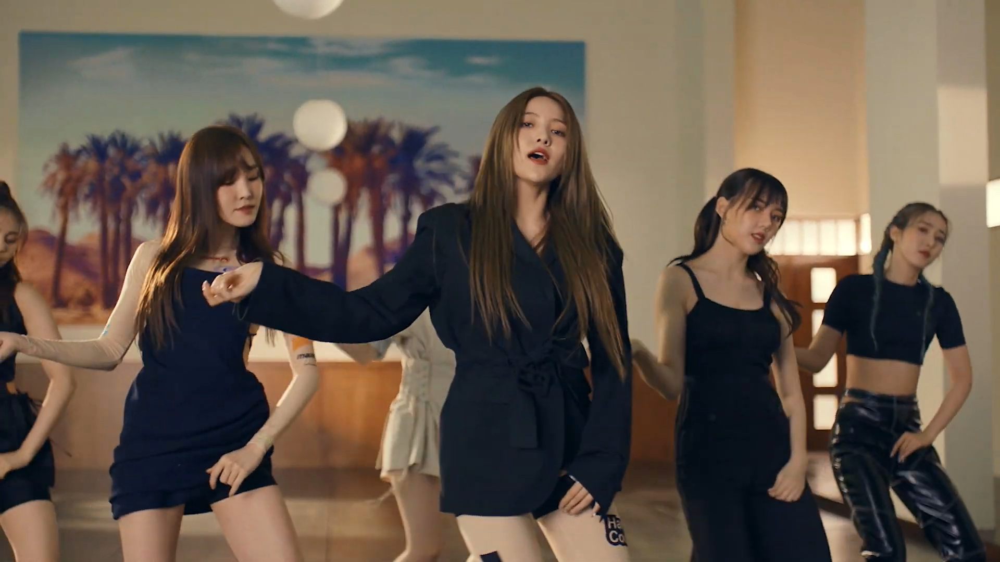
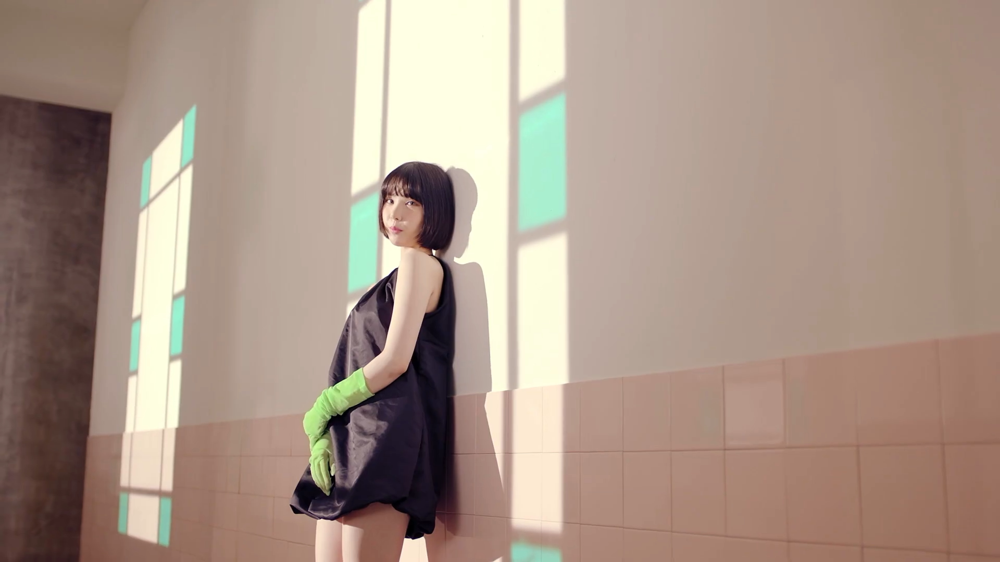
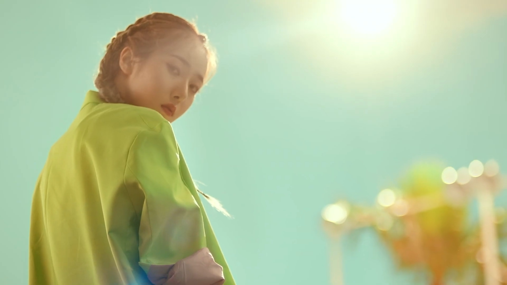
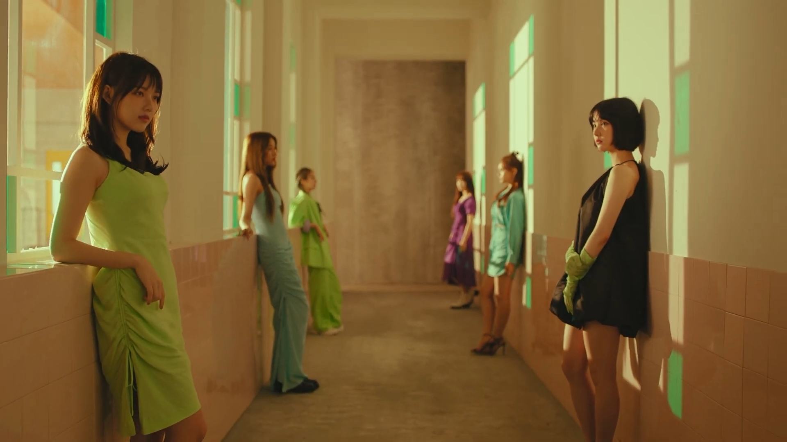
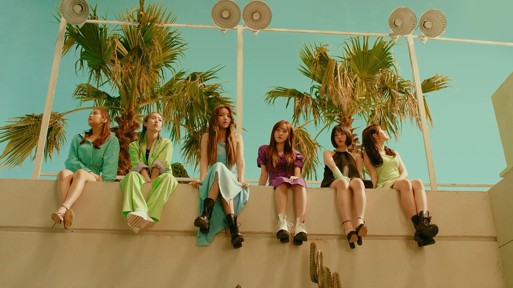

# \[ 여자친구 (GFRIEND) - 열대야 (Fever) \]

## 더 성숙해진 컨셉? "지금 이 순간 후회 없이 보여주고 싶어"

걸그룹 '여자친구'가 미니 7집 «FEVER SEASON»으로 돌아왔다. (사진: 여자친구 멤버 '소원' / ‹열대야› 뮤직비디오)

이번 앨범의 타이틀곡 ‹열대야›는 여자친구의 두 번째 여름 시즌송이다. 여자친구의 첫 여름 시즌송은 작년에 발매된 «Sunny Summer»의 타이틀곡인 ‹여름여름해›였다. ‹여름여름해›에서 여자친구는 경쾌한 리듬과 밝은 화면에서 상큼발랄한 보이스와 댄스를 선보이며, 걸그룹 '여자친구'의 이름처럼 "남자들에게는 사랑스러운 여자친구, 여자들에게는 모든 것을 터놓을 수 있는 친한 여자친구"에 어울리는 모습을 어김없이 보여줬다.

여자친구의 트레이드마크가 되어 버린 '파워청순'은 이번 시즌송인 ‹열대야›에서도 유감없이 발휘되었다. 파워풀한 칼군무로 무대를 장악하는 카리스마에서, 여자친구에게서는 청순을 넘어선 무언가가 느껴지기까지 한다. ‹열대야› 뮤직비디오에서 느껴지는 다소 심오하고 사뭇 진지한 기운은, 여자친구가 이전에 ‹FINGERTIP›에서 진입하려 했던 '성숙한' 이미지로의 변신이 다시 시도되는 것이 아닐까 하는 추측을 남긴다.

‹열대야›의 가사에서 여자친구는 "지금 이 순간 후회 없이 보여주고 싶어" 라고 말하고 있다. 그들이 과연 2년 전에 ‹FINGERTIP›에서 다 이루지 못한 이미지 변신에 성공해서 그들의 성장을 '후회 없이 보여줄 수 있을지' , 그 귀추가 기대된다.

- [여자친구 ‹열대야› 쇼케이스 (2019-07-01) 영상 보러가기 (V LIVE)](https://www.vlive.tv/video/137607)
- [여자친구 ‹열대야› M COUNTDOWN 무대 (2019-07-04) 영상 보러가기 (YouTube)](https://www.youtube.com/watch?v=5uiUxN7Leek)

## 이 뜨거운 사랑도 언젠가 식을 것을 알지만: "열대야같은 사랑을 하고 있어"

모든 것에 앞서, 여자친구는 2019년 7월 현재 데뷔 5년차의 한복판에 있는 아이돌 걸그룹이다. 스테이지에서는 매년 수십 개의 아이돌 그룹이 데뷔를 하고 또 사라져 간다. 주목을 받고 흥행에 올라타는 아이돌 그룹은 그 중 얼마 되지 않는다. 수 년 간 활동을 지속하면서 인기를 유지하는 그룹은 극소수에 불과하다.

그래서 데뷔 초기의 아이돌 그룹은 자신만의 확고한 정체성과 특징을 확보하기 위해 애쓰지만, 막상 대중적 성공을 누리게 되면 그들의 '컨셉'은 곧 지금의 인기를 유지하기 위한 강력한 무기이자, 미래의 가능성을 봉쇄할 수 있는 강력한 족쇄가 되는 경우가 대부분이다. 한국 아이돌 시장의 역사에는, 자꾸 비슷한 컨셉으로 활동을 하다 어느 순간 사업성을 잃어버린 그룹도 있고, 멤버들이 소화할 수 없는 수준의 컨셉을 자꾸 실험하다 동력을 잃어버린 그룹도 있고, 초기부터 너무 다양한 컨셉을 도입했다가 이제는 더 시도할 게 남지 않아 버린 그룹도 있다. 굳이 구체적인 예를 들지 않아도 누군가를 생각해낼 만할 것이다.

요컨대 컨셉의 효용은 소진된다. 한 컨셉에 머물러 있으면 살아 남을 수 없다: "변화하지 않으면 도태된다"라는 말은 이제 너무나 유명해서, 가장 스스로 변화하지 않는 사람들조차 이 말을 쓰고 있을 지경이다. 그러나 어느 방향으로 변화할 것인가? 변화는 실험과도 같아서 결과를 예측할 수 없지만, 문제는 실패대책이다. 과거의 컨셉을 재사용한다면 아무리 잘 해도 오마주를 초월하지 못하며 심하면 자기표절이라는 비난까지 듣게 된다. 그래서 아이돌 그룹에게 변화는 비가역적이다.

‹열대야›로 컴백하는 여자친구에게 아직도 대표 수식어로 '파워청순'이 따라붙고 ‹유리구슬›이 회자되는 것은 비극 아닌 비극이다. 사실 여자친구는 '파워청순'을 탈피하기 위한 시도를 정말 오래 한 편이다. ‹유리구슬›, ‹오늘부터 우리는›, ‹시간을 달려서›로 이어지는 데뷔 초기의 '학교 3부작'이후 여자친구는 ‹너 그리고 나›에서 학교를 완전히 졸업했다. ‹FINGERTIP›(«THE AWAKENING»)에서는 '성장한 소녀들의 사랑 이야기'를 '소녀감성' 빠진 파워풀한 사운드와 영상에 담으려 했고, ‹귀를 기울이면›(«PARALLEL»)과 후속곡 ‹여름비›(«RAINBOW»)에서는 한결같이 사랑하는 믿음이 깨지는 듯한 복잡한 서사를 연출했다.

결과적으로 그런 시도들의 성과를 마냥 좋게 평가하기는 힘들다. 가장 과감한 시도였던 ‹FINGERTIP›의 성적이 가장 좋지 않았으며, 보수적인 시도 중에서도 ‹귀를 기울이면›이 ‹여름비›보다는 더 나은 성적을 받았다. 최근의 3부작인 ‹밤›, ‹여름여름해›, ‹해야›의 인기가 폭발적이었는데, 사실 ‹여름여름해›조차 여자친구 최초의 여름 시즌송이 아니다. 학교 3부작의 두번째 곡인 ‹오늘부터 우리는›의 여름 시즌송 성격이 아주 강하기 때문에, '밤-여-해' 3부작은 그 구조에서마저 학교 3부작의 자기모방이다. 그래서 밤-여-해 3부작은 ‹밤›에서 새로운 컨셉에 진입하고, ‹여름여름해›에서 그것을 생소하게 만들었다가, ‹해야›를 통해 여자친구라는 그룹의 정체성으로 그것이 합쳐지고 마침내 온전히 새로운 컨셉으로 이전하려는 시도를 보여 주는 구조로 되어 있다.

그렇다면 이번 신곡인 ‹열대야›는 어떤가? (사진: 여자친구 멤버 '예린' / ‹열대야› 뮤직비디오)

‹열대야› 뮤직비디오는 처음부터 시청자들에게 돌이킬 수 없는 선전포고를 놓는다. 발소리가 울려퍼지고 예린이 힘없이 걸어나온다. 실제로 아픈 것이 아닌가 싶을 정도로 '열대야'에 시달린 모습의 연출을 잘 소화한 예린의 모습은, 뮤직비디오 썸네일에서 소원의 '냉미녀'적인 매력을 강조해 놓은 모습과는 굉장히 상반되게 느껴지기까지 한다.

‹열대야›에서 여자친구는 더 이상 우리를 보고 웃어 주지 않으며, 서로를 보며 사랑에 빠진 듯 만사태평히 웃지도 않는다. 그들은 애교를 앞세우거나, 귀엽고 사랑스러운 모습을 보여 주거나, 지나치게 열심히 하지도 않는다. 대신, 그들은 여전히 이전과 같이 계속될 듯한 바로 그 여자친구의 모습을 하고 있으면서, 여자친구라는 그룹이 지금까지 보여 줬던 컨셉의 핵심부를 전면으로 거부한다. (사진: 여자친구 단체 안무, 멤버 '은하', 멤버 '신비', 멤버 '유주', 멤버 '엄지' / ‹열대야› 뮤직비디오)

대부분의 아이돌 걸그룹 컨셉이 순종적이고 수동적인 여성상을 아주 약간 비틀어 만들어진다는 것은 널리 알려진 사실이다. 걸그룹 노래가사 중 아주 많은 부분이, 여성적 화자가 자신과 '썸을 타는' 남자에게 '밀당'을 하거나, 남자가 주도하는 관계 진전을 응원하거나, 사랑에 빠진 순간 아무 것도 할 수 없게 되었다거나, 갈등 상황에서도 "어떡하지" 하고 만다거나, 심지어는 자신의 좋아하는 마음이 드러나서 들킬까봐 조마조마하는 모습을 그리듯이 쓰여 있다. 남자 가수와 달리 여자 가수들은 신나는 순간에도 제정신을 놓아 버리고 세상의 룰을 무시하고 놀아제끼지 않는다; 최대한 현실을 즐겨야 하지만, 그런 상황에도 자아를 규율하는 최소한의 룰은 불변한다. 이른바 '무해한' 여성상이다.

여자친구 역시 데뷔작인 학교 3부작에서 귀엽고 발랄한 여고생으로 등장해 아이돌 경력의 첫 발을 떼었으며, 이후 활동을 지속하는 걸그룹으로서 그런 여성상의 이미지가 재생산되는 데 일조한다는 의혹에서 완전히 자유롭지는 못했다. 비록 ‹밤›, ‹여름여름해›, ‹해야›에서 이전의 여고생 이미지를 완전히 털어 버리려는 시도가 있었으나, 그 역시 여자친구의 기존 이미지에 다소 기대어 이루어진 부분이 있다. ‹밤›에서 다같이 텐트에서 합숙을 하고 논다거나 함께 들판을 뛰어가는 장면은 거의 만화영화의 클리셰를 가져다 쓴 듯한 모습이며, 이어지는 곡에서도 전체적으로 파워풀하지만 동시에 여자친구 멤버들의 귀여운 매력을 발산하는 톤이 이어진다.

‹열대야›에서는 바로 그 지점에서 파워청순이 지금까지 여자친구에게 복합적인 매력으로 작용하던 중요한 근거를 과감히 제거한다: 카메라를 보고 전혀 웃지 않는 것이다. ‹열대야› 뮤직비디오에서는 여자친구 멤버들이 마치 열대야에 지친 듯, 앵글 건너편의 시청자를 노려보고 있다.

‹열대야›의 가사는 "지금 이 순간 후회 없이 보여주고 싶어"로 시작한다. "그저 네 심장을 뛰게 하고 싶어"로 이어지는 가사는, 얼핏 ‹열대야›가 이전의 여자친구 노래처럼 팬들에게 바쳐지는 뉘앙스의 평범한 사랑 노래인 것처럼 보이게 한다. 그러나 한국인이라면 여기서 기본적인 의문을 가질 것이다: 왜 하필 '열대야'인가? 도대체 누가 열대야를 사랑하는가; 제정신이라면 열대야가 지나가기만을 기다리지 않는가?

이 시점에서 지적해야 할 것은, 이 곡의 가사에서 사랑을 대하는 근본적 논조가 이전의 곡들과는 아주 다르다는 점이다. ‹열대야›의 화자는 "너와 나" 사이에 "열대야 같은 사랑을" 하고 있다. 이는 제정신이라면 "너무나 뜨거워 터질 것만 같아" 하고 거부감이 들어야 하는 사랑이다. 그러니 평범하게도 "아직도 깊어져만 가는 열대야", "여전히 사라지지 않는 열대야" 라고 한탄을 한다.

열대야같은 사랑을 끝내지 못하는 이유가 무엇일까? 당연히 열대야가 자연 현상이기 때문이다. 우리는 연애감정에 깊이 빠지면 자신의 행복과 상대방의 행복을 동일시하게 되고, 상대방을 관찰하며 그 반응 하나하나에 민감해지며, 이런 명백한 인지 오류를 자발적으로 교정하지 못해 매우 불안정한 심리 상태에 놓이게 된다. 이런 상황에서 좋은 결말은 적당히 싸워 보는 것이다. 이로써 사랑하는 상대방과 자신이 결국 다른 사람이라는 것을 인정하고, 행복의 기준이 다르고 또 감정을 구체적으로 표현하는 방법이 다르다는 사실을 꾸준히 익혀 나가는 것이다. 반대로, "우린 너무 달라" 하며 불같이 싸우고 헤어져 버리는 것이야말로 자신의 지속적 행복을 위해 좋지 않은 결말이 되겠다.

이런 나쁜 결말에 대해 잘 알고 있든 그렇지 않든 사랑에 빠져 버리는 순간은 거의 누구에게나 존재한다. 이는 열대야만큼이나 잘 예견되어 있으나 예방할 수 없는 고통과 비슷하다. 그래서 우리는 열대야와 같은 사랑을 매번 고통스럽게 겪고 또 다음에 비슷한 고통이 찾아올 예정에 무방비하게 스스로를 놓아두기보다는, 열대야를 겪는 동안 점차 성장하고 성숙해지며 지혜로워지는 대처를 할 필요가 있다. (사진: 여자친구 멤버 '예린' / ‹열대야› 뮤직비디오)

곡의 중반부에서 일어나는 반전은 소원이 "너를 만난 후"에 나타나는 "새로운 나"를 말한다는 것이다. 이어지는 파트에서 예린은 "작은 세상에 큰 꽃을 피워", 마침내 "날 사랑하는 법을 알 것만 같아" 라는 중대 선언을 한다. 이 선언은 1절 후반부의 "너무나 뜨거워 터질 것만 같아" 와 극단적으로 대조된다. 사랑의 뜨거움에 당장 터져 버릴 것 같은 상황에서, 그것을 극복하는 방법으로 자신을 사랑해야 한다는 대안을 제시하는 구문이기 때문이다. 그래서 이 선언에 이어져 반복되는 "지금 이 순간 후회 없이 보여주고 싶어"는 사뭇 다르게 들린다. 뜨거운 사랑의 순간에 속박되어 "네 심장"이 뛰는 것에 신경쓰기보다는, 나를 사랑하고 나의 행복을 위해 "이 순간" 후회 없이 "너"를 사랑할 것이며 "네 심장"이 뛰게 하는 것으로부터 내 행복을 더해 갈 것이라고, 사랑을 대하는 태도를 완전히 바꾸기 때문이다.

그래서 ‹열대야›는, 미처 그때 좋아한다고 말하지 못한 사람을 꼭 다시 만나길 기도하는 ‹시간을 달려서›나, 처음 본 순간 특별함을 느끼고 설렘 가득한 목소리로 시작을 말하는 ‹너 그리고 나›나, 갑작스레 다가왔던 사랑과 엇갈렸지만 기적이 이루어지길 바라는 ‹여름비›와는, 아주 다른 방향으로 사랑에 접근하는 노래이다. 그래서 ‹열대야›에서 여자친구는 여전히 '파워청순'하지만 이전처럼 아련해 보이지도 않으며 카메라를 보며 웃지도 않는다. (사진: 여자친구 전원 등장 연출 / ‹열대야› 뮤직비디오)

이런 변화된 태도는 비단 사랑을 대하는 ‹열대야› 노래 가사 속 화자에게서만 발견되는 것이 아니다. ‹열대야›는 걸그룹 여자친구의 이번 앨범 타이틀곡이고 활동곡이기 때문에 ‹열대야› 화자는 여자친구 멤버들에게 투사된 채로 우리들에게 전달되며, 사랑에 대한 그런 메시지를 우리가 수용하는 과정에도 역시 여자친구가 적극적으로 개입한다. 즉 여자친구의 이전 활동곡들이 아련한 사랑을 주제로 했으나 실질적으로는 여자친구가 아련한 사랑의 모델로서 팬들에게 사랑을 얻었듯, ‹열대야› 활동을 시작한 여자친구 역시 사랑하는 팬들과의 관계에 매몰되지 않고 그것을 어느 정도 객관화하며 각자의 자아에 어울리는 옷을 입고 있다는 것이다. 그래서 ‹FINGERTIP›에서 여자친구가 "가리킨 순간 내 것이 될 것 같아"라고 도발적인 선언을 한 것과 같이, ‹열대야›의 톤 역시 여자친구의 걸그룹 활동이 앞으로 어떤 톤으로 진행될지에 대한 불가역적인 선언이 된다.

위 사진에서 학교 3부작을 연상시키는 학교같은 건물에서 여자친구 멤버들이 가만히 멈춰서 벽에 기대어 서 있다든지, ‹너 그리고 나›를 연상시키는 건물 외벽에 걸터앉아 마찬가지로 무표정으로 힘없이 앉아 있다든지 하는 모습들은 어쩌면 기존에 다소 '무해한' 컨셉으로 활동했던 과거를 곱씹는 장면으로 보이기도 한다. 가정이 옳다면, 학교 3부작과 시퀄인 ‹너 그리고 나›(«LOL»)은 그들에게 열대야같은 사랑의 시작이었고 또 동시에 열대야같은 고통의 시작이었을 것이다. 그래서 그들은 자신의 본모습을 사랑하기를 택하며, 여자친구의 팬들 역시 이전의 활동에 비추어 여자친구에게 기대하는 것과 여자친구의 본모습은 다르다는 점을 인정하라고 한다. 그렇게 다른 지점을 찾아 나가면서도 서로를 이해하고 배려하는 지점을 찾아 나가는 것이 성장하는 사랑이기 때문이다. 그래서 여자친구는 "후회 없이 보여주고 싶어" 한다.

여자친구의 변화를 진심으로 응원한다. 여자친구뿐만 아니라 앞으로 많은 아이돌 그룹이 이와 같은 컨셉 변화 시도에 있어서, 컨셉 실험의 당사자인 본인들의 어려움을 극복하고 나온 이후에는 충분히 객관화된 평가를 받을 수 있기를 바란다. 생소하다는 이유로 '너무 변했다'라든지, '어울리지 않는다', '무리한 시도였다' 같은 평가를 섣불리 받는 일이 없기를 바란다. 성숙한 사랑을 하는 팬이라면, '내가 키운 스타'라면서 초기 컨셉이 좋았다느니 하면서 안티나 다름없는 행세를 하기보다는, 자신이 응원해 온 스타의 실험적 시도 하나하나를 계속 응원해 줄 수 있지 않을까?

물론 실력이 충분치 않았다거나, 무리해서 영 안 맞는 컨셉을 시도했다가 실패하는 케이스도 있을 것이다. 그런 경우에는 결국 시장의 선택이 따끔한 결론을 내려 줄 것이다. 그러나 이 글을 마치며 말하고자 하는 것은, 세상에는 실력과 성과에 꼭 알맞지 않은 결론이 내려지는 경우가 꽤 많다는 것이다. 우리는 어린이들에게 '적성과 흥미에 맞는 직업을 가져라' 라고 가르치지만 어른들끼리는 흔히 '결국 돈 벌려고 회사 다니지' 라고 자조적으로 말하고는 한다. 놀랍게도 그렇게 자기가 성실히 일할 마음이 없다고 끊임없이 말하는 우리가, 다른 사람들에게는 정말 쉽게 '진정성'을 요구한다. 과연 우리가 요구하는 '진정성'은 그 사람의 마음이 진정함을 보고 있는 것일까, 아니면 그냥 우리 마음으로 진정히 와닿는 느낌이 들기를 원하는 것일까? 오늘도 수많은 커플이 싸우고 있을 것이다. "나를 사랑하긴 해?"
